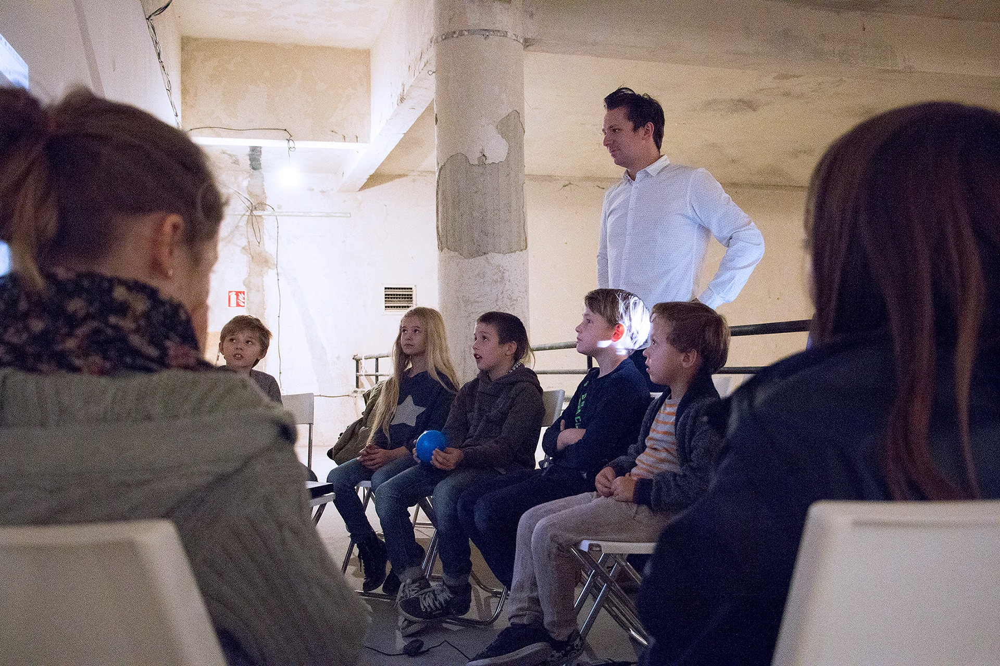

# Hacking Game

This simple application was part of our one-time workshop for small kids (10 years old) to increase their awareness about passwords - how to create one, what can happen if someone cracks your password, how a hacker can crack your password based on publicly accessible information.

To simulate the real process a role of hacker had been given to the kids. We gave them faked Facebook profiles and their goal was to collect as many insights as possible about the profile - favorite hobby, date of birth, name of pet, favorite person and so.

The web application allows to create profiles in configuration file (config.js) with name, password and secret information. Then kids simply try different passwords from information they gather from printed profiles. The application provides text feedback based on the inserted password. It simply counts similarity of real password and password which was inserted. The similarity is counted by Levenshtein Distance algorithm and the application provides a text advice based on this similarity.

Feel free to use it, update it or improve it. Don't hesitate to ask me for anything kruchna.o@gmail.com

## License
"THE BEER-WARE LICENSE" (Revision 42):
<kruchna.o@gmail.com> wrote this application.  As long as you retain this notice you
can do whatever you want with this stuff. If we meet some day, and you think
this stuff is worth it, you can buy me a beer in return.   Poul-Henning Kamp
